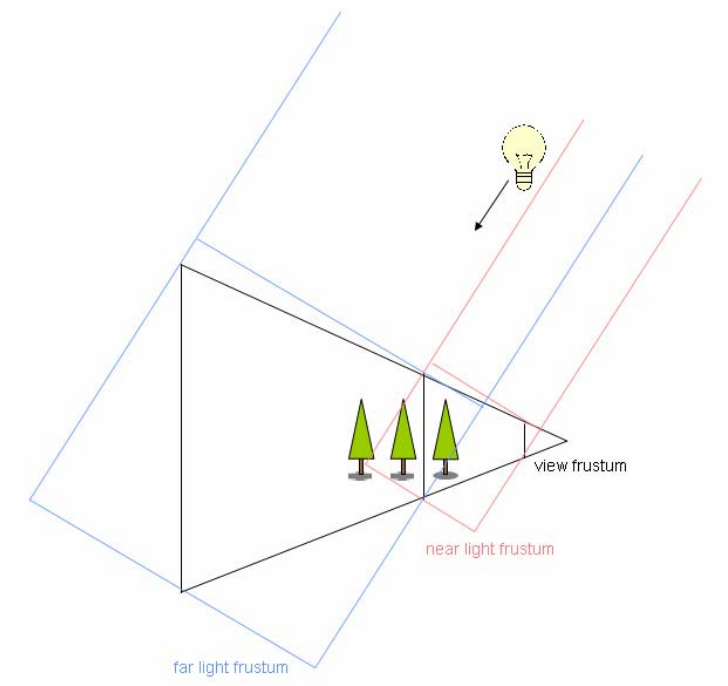

# 级联阴影贴图 Cascaded Shadow Maps(CSM)

## 概述

CSM 通常用来在大型场景模拟太阳投射的阴影。

对于大型场景，普通阴影贴图存在内存使用过大的问题：在一张阴影贴图中捕捉所有对象需要阴影贴图具有非常高的分辨率。

使用多张阴影贴图就可以解决这个问题：
- 对于近处的场景使用较高分辨率的阴影贴图
- 对于远处的场景使用粗糙的阴影贴图
- 在两张阴影贴图过渡的地方选择其中一张使用

因为远处的对象只占画面的很少一部分像素，而近处的对象占据了画面的很大一部分，进行这样的处理显然非常合理。

CSM 使用平行分割原理实现使用多张阴影贴图，如下图所示：通过给眼视锥分片，为每个分片生成一个相同分辨率的***光空间深度图***。因为太阳是方向光源，所以它的光锥体是一个长方体(图中的红色和蓝色部分)。

CSM 方法的基本思路：利用眼睛看到的片段，根据其所在分片位置，转换为相应光空间深度，和光空间深度图比对，若深度大于深度图内的深度，则处于阴影。